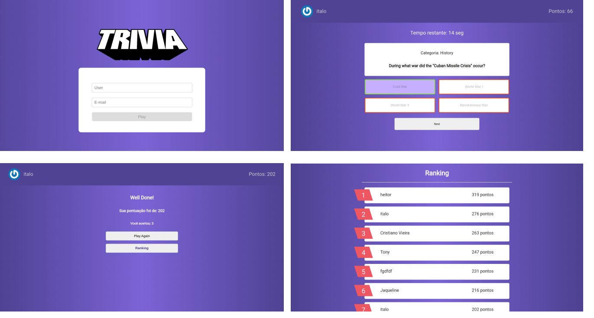

<h1 align="center">
     <a href="#" alt="site de despesa"> Trivia </a>
</h1>

<h3 align="center">
    Jogo de perguntas e respostas, teste esta aplicação e veja em que colocação você fica em relação as pessoas que já testaram, basta acessar este <a href='project-trivia-quiz.netlify.app'>link.</a>
</h3>

<h4 align="center">
	🚧   Concluído 🚀 🚧
</h4>

Tabela de conteúdos
=================
<!--ts-->
   * [Sobre o projeto](#-sobre-o-projeto)
   * [Funcionalidades](#-funcionalidades)
   * [Layout](#-layout)
   * [Tecnologias](#-tecnologias)

<!--te-->

## 💻 Sobre o projeto

Trivia - Este projeto foi desenvolvido em equipe e teve como objetivo criar um jogo de perguntas e respostas gamificado onde no final o usuário pode ver seu ranking em relação aos outros usuários que testaram a aplicação. 

Foi utilizado o kanban como metodologia de projetos a partir do trello e o slack como ferramenta de comunicação assincrona.

---

## ⚙️ Funcionalidades

- [x] Cadastro de usuário
- [x] Tela de jogo com perguntas e opções de respostas
- [x] Tela de Ranking

---

## 🎨 Layout

### Web

  

### Mobile
    
  

## 🛠 Tecnologias

As seguintes ferramentas foram usadas na construção do projeto:

-   **React Router Dom**
-   **React**
-   **Redux**
-   **Figma**
-   **Firebase**
-   **Sass**
